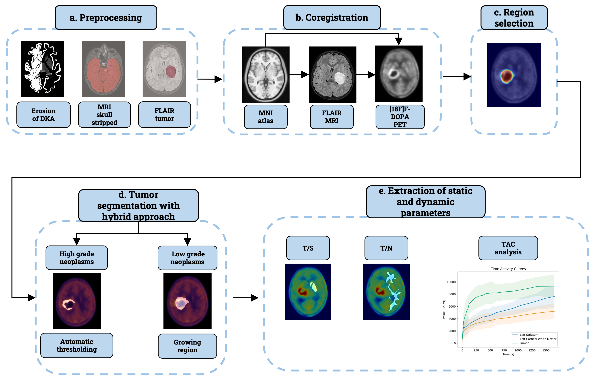

# Pediatric FDOPA Pipeline

## About

Our pipeline is designed to assist nuclear medicine physicians in their clinical workflow by extracting both static (T/S and T/N) and dynamic parameters (slope, time to peak, and dynamic slope ratio) from 18F-FDOPA PET images of pediatric brain tumors. Implemented using open-source Python libraries, the pipeline automates the entire process from coregistration to parameter extraction. Additionally, we propose a method for visualizing intra-tumoral regions, providing a comprehensive tool for clinical evaluation and decision-making.
## Dipendencies 
The software code has been developed using Python 3.11 version, running in Centos 7.
## Installation
* Install [Python](https://www.python.org/downloads/)
* Install [pip](https://pip.pypa.io/en/stable/installation/)
* Install [git](https://git-scm.com/book/en/v2/Getting-Started-Installing-Git)

`pip install --user nibabel antspyx matplotlib pandas` 

`git clone https://github.com/tfunck/pediatric_fdopa_pipeline`

## Input Data formatting

All data must be formatted according to the [BIDS PET](https://bids-specification.readthedocs.io/en/stable/04-modality-specific-files/09-positron-emission-tomography.html) format.

PET image file:

`<study_directory>/sub-<subject_id>/pet/sub-<subject_id>_pet.nii.gz`

PET header file:

`<study_directory>/sub-<subject_id>/pet/sub-<subject_id>_pet.json`

MRI image file:

`<study_directory>/sub-<subject_id>/anat/sub-<subject_id>_T1w.nii.gz`

### Example
`data/sub-1/pet/sub-1_pet.nii.gz`

`data/sub-1/pet/sub-1_pet.json`

`data/sub-1/anat/sub-1_T1w.nii.gz`

## PET .json header
Our pipeline takes in input both static and dynamic PET scans. For dynamic PET the required fields are:

* 'FrameDuration'
* 'FrameTimesStart'

### Example contents of a PET .json header :

{

	"FrameDuration": [
		60,
		60,
		60],
		
	"FrameTimesStart": [
		0,
		60,
		120]

}

### How to run:
* Organize your data as above
  
* Download (or git clone) this repository
  
* Add a repository 'tumor_MRI', containing the mask of MRI lesion for each subjcet
  
* pediatric_fdopa_pipeline.py contains calls for all submodules.
  
Current framework is organized in five interconnected modules: Preprocessing, Coregistration, Region selection, Tumour segmentation, Static and Dynamic parameters extraction. 

## Command to run from terminal: 
python3 pediatric_fdopa_pipeline.py -i /Path for input data directory -o/Path for output file directory

### User options

* -i : Path for input data directory
* -o : Path for output file directory
* -s : Path for stereotaxic template file; default=atlas/mni_icbm152_t1_tal_nlin_asym_09c.nii.gz
* -a : Path for stereotaxic label file; default='atlas/dka.nii.gz'
* -vol_MRI : Path for flair tumor masks; default='tumor_MRI/'

### Warning

The pipeline does not keep track of whether upstream files (e.g., *file_1*) are older than downstream files (e.g., *file_n*). Hence, if you delete an upstream file and rerun the pipline, it will not create a new version of the downstream file.

**pipeline_stage_1** --> *file_1* --> ...(more stages in pipeline)... --> **pipeline_stage_n** --> *file_n*

If you wish to re-run an analysis for a given set of subjects, it is recommended to delete the entire subject directories (or move them to a backup location) and re-run the entire pipeline for those subjects. This way there is no risk of ending up with out of date downstream files that do not reflect the new information in the upstream files that they depend on.
